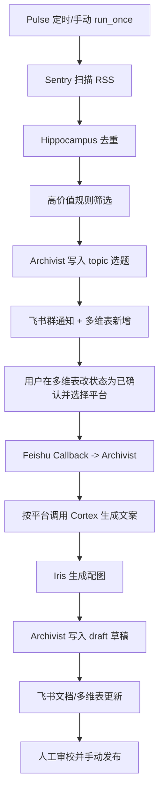

# 04. 当前功能、执行链路与需求满足度回顾

## 1. 当前完整执行链路

---

## 2. 已有能力清单

## 2.1 信息获取与筛选

- 支持 RSSHub + wechat2rss 源
- 支持去重（url_hash）
- 支持高价值规则筛选（长度/图像/关键词）
- 选题阶段不再调用大模型

## 2.2 选题管理

- 选题写入 `record_type=topic`
- 支持来源字段 `source_info`
- 选题摘要来自源内容（`topic_summary`）

## 2.3 回调创作

- 多维表状态确认后回调触发
- 平台分流生成草稿（每个平台独立稿件）
- 防重复上下文（读取历史草稿）

## 2.4 平台风格策略

- 长文平台（公众号/知乎/掘金）：技术解读、影响、科普
- 短文平台（推特/小红书）：记录、日志、感慨、口语化

## 2.5 文档与归档

- 本地归档与飞书 Drive 目录一致
- 目录：`YYYY-MM-DD/topic_pool` 与 `YYYY-MM-DD/draft_pool`
- 飞书文档标题已优化（日期/类型/来源/平台/trace）

## 2.6 运维能力

- `make run-action` 一键验证
- `make clean-restart` 清缓存重启
- `make nuke-rebuild` 全量重建

---

## 3. 需求满足度对照

| 需求项 | 当前状态 | 说明 |
|---|---|---|
| 高价值信息发现 | 已满足 | Pulse 规则筛选 + 去重 |
| 选题入库与人工确认 | 已满足 | topic记录 + 状态确认触发 |
| 来源字段展示（推特-id/公众号-xxx） | 已满足 | `source_info` 已写入表格/文档 |
| 回调触发多平台创作 | 已满足 | callback按平台循环生成 |
| 平台文风分层（长文/短文） | 已满足 | style policy + Cortex策略注入 |
| 飞书云盘分层与本地一致 | 已满足 | `date/topic_pool`、`date/draft_pool` |
| 表格文档链接指向 Drive | 已满足（有条件） | doc创建成功时写 Drive；失败时为空（不写localhost） |
| 群通知全量使用 Drive 链接 | 部分满足 | 失败时通知仍可能降级到本地链接兜底 |
| 选题不做AI总结 | 已满足 | topic阶段不调Cortex |
| 两套状态分表管理 | 未覆盖（当前单表） | 目前一张表用 `record_type` 区分 |

---

## 4. 当前边界与注意事项

1. 当前是“单多维表”方案：topic/draft 共表，靠 `record_type` 区分。
2. 回调触发依赖状态值命中确认态；状态命名需规范。
3. 飞书文档创建失败时，系统会本地降级保证流程不中断。
4. 发布动作仍是人工执行，不做自动发平台。

---

## 5. 推荐下一步（可选）

1. 引入“双表模式”（topic_table + draft_table）
2. 增加回调幂等锁（避免重复生成）
3. 增加“只在 Drive 成功时通知”的开关
4. 增加状态机校验（非法状态迁移拦截）
